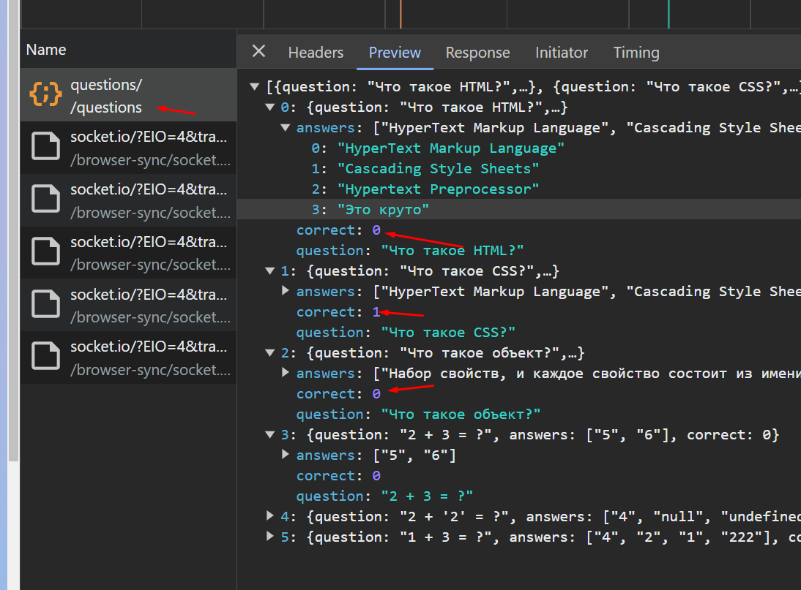
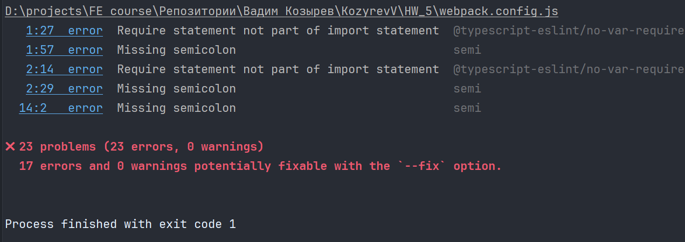

1. Я говорил по этому поводу несколько раз. Юзер не должен узнать правильный ответ до того как он ответит. Сейчас это можно сделать через network 
2. линтер выдает 23 ошибки. Если в проекте есть линтер, то игнорировать его неправильно 
3. часть функций из index.ts можно вынести в другие файлы. Например, всё что касается таймера 
